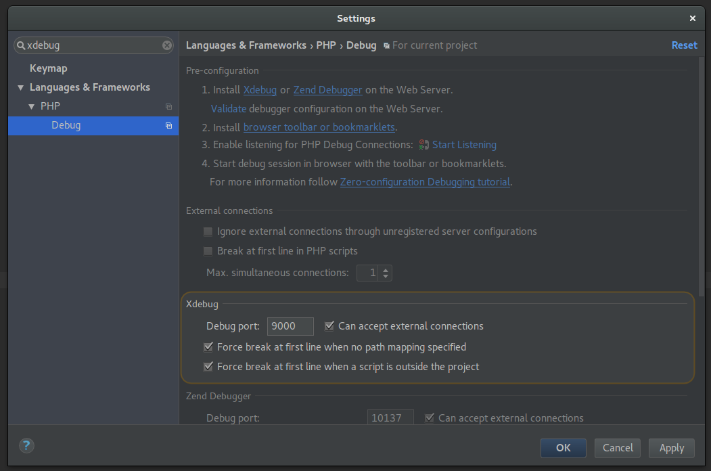
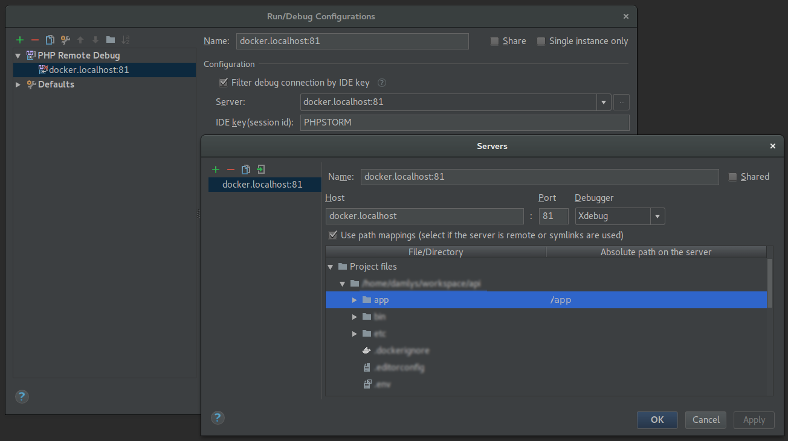
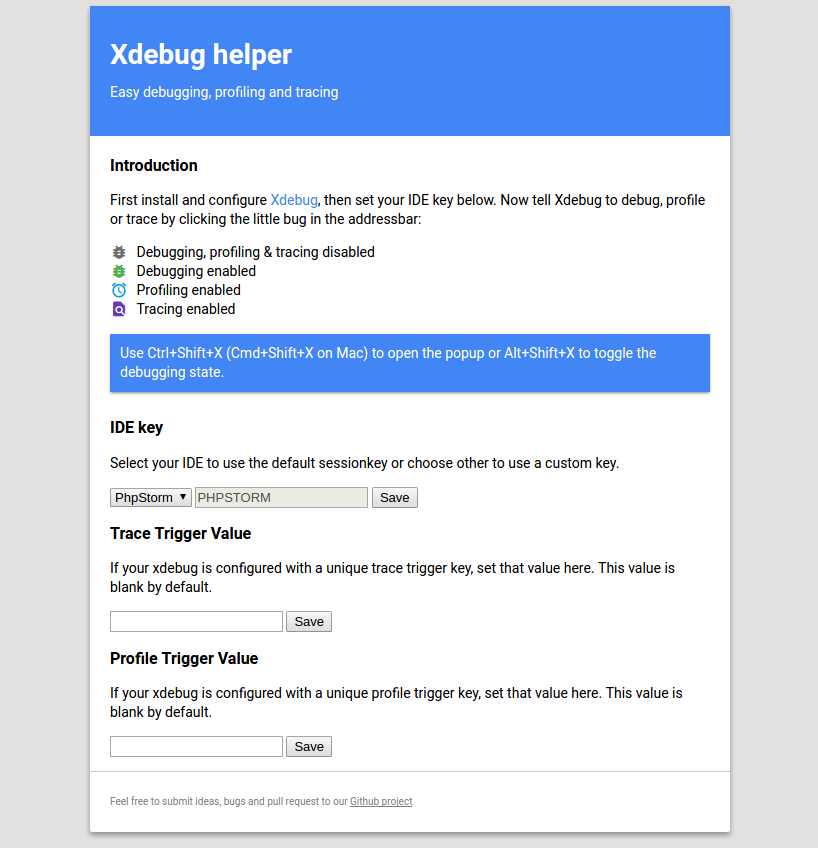
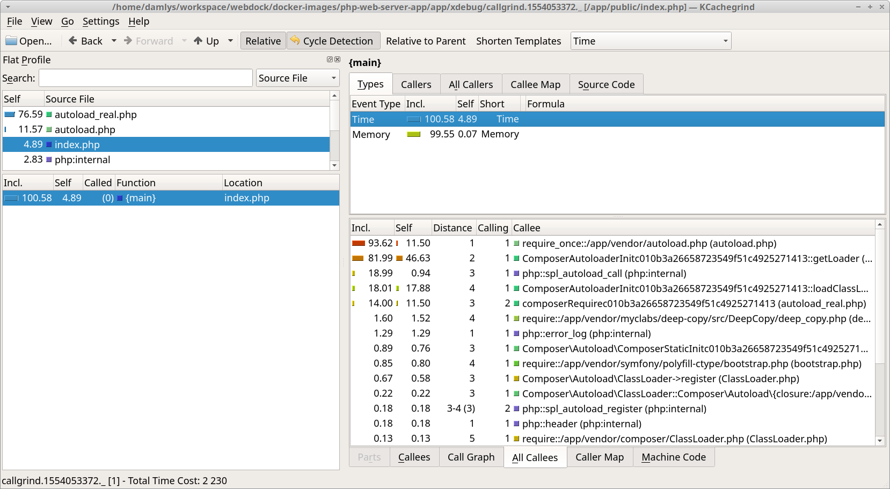

[<-- ToC](../README.md#table-of-contents)

# PHP Debugging tools

### PHPStorm settings





### Chrome plugin

[Xdebug helper](https://chrome.google.com/webstore/detail/xdebug-helper/eadndfjplgieldjbigjakmdgkmoaaaoc)



### Callgrind application

[KCachegrind](https://kcachegrind.github.io/html/Home.html)



Linux/Ubuntu:

```
$ apt install kcachegrind
```

MacOS:

```
$ brew install qcachegrind
```

Windows:

see [QCacheGrind](https://sourceforge.net/projects/qcachegrindwin/)
